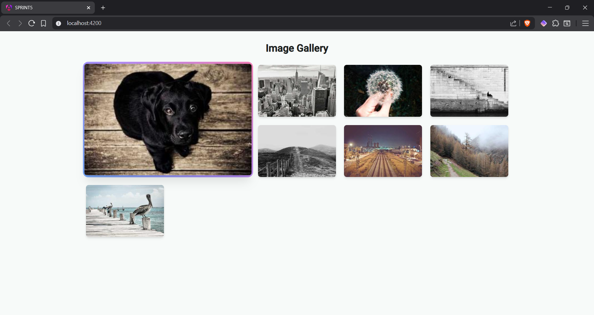
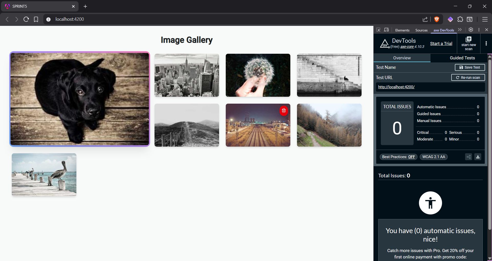
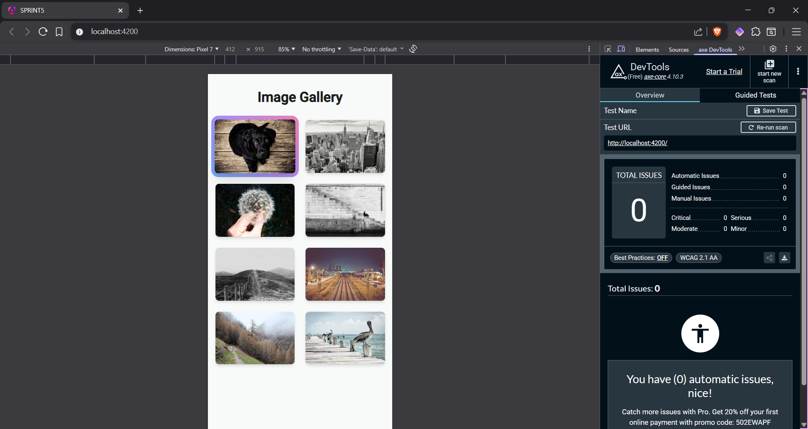
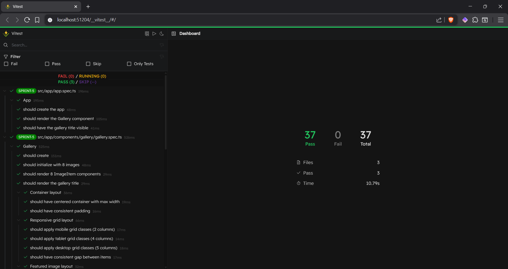

# 🖼️ Angular Image Gallery

A modern, responsive image gallery built with Angular 21, featuring interactive image management, professional styling with Tailwind CSS, and full accessibility compliance.

## Preview:



## ✨ Features

- **📱 Responsive Design** - Adapts seamlessly across mobile (2 cols), tablet (4 cols), and desktop (5 cols)
- **⭐ Featured Image** - First image displayed prominently as 2×2 grid on desktop with gradient border
- **🗑️ Interactive Deletion** - Remove images with confirmation dialogs and smooth transitions
- **♿ Accessibility First** - Zero issues detected by axe DevTools, WCAG compliant
- **🎨 Modern UI** - Clean interface with Tailwind CSS v4 and PrimeIcons
- **⚡ Zoneless Architecture** - Leverages Angular 21 signals for optimal performance

## 🚀 Tech Stack

- **Angular** 21.0.0 (Standalone components, Signals, Zoneless change detection)
- **Tailwind CSS** 4.1.17
- **PrimeIcons** 7.0.0
- **Vitest** 4.0.12 (Testing framework with UI)
- **TypeScript** 5.9.3
- **Bun** 1.3.3

## 📁 Project Structure

```
src/
├── app/
│   ├── components/
│   │   ├── gallery/
│   │   │   ├── gallery.ts
│   │   │   ├── gallery.html
│   │   │   ├── gallery.css
│   │   │   └── gallery.spec.ts
│   │   └── image-item/
│   │       ├── image-item.ts
│   │       ├── image-item.html
│   │       ├── image-item.css
│   │       └── image-item.spec.ts
│   ├── interfaces/
│   │   └── image.ts
│   ├── app.ts
│   ├── app.html
│   ├── app.config.ts
│   └── app.routes.ts
├── index.html
└── styles.css
```

## 🛠️ Installation

```bash
# Clone repository
git clone <repository-url>

# Install dependencies
bun install

# Run development server
bun start

# Run tests
bun test

# Run tests with UI
bun test:ui

# Build for production
bun run build
```

## 🎯 Key Patterns

### Component Architecture

- **Separation of Concerns** - Presentational components (ImageItem) vs Container components (Gallery)
- **Unidirectional Data Flow** - Parent → Child via `input()`, Child → Parent via `output()`
- **Immutable State Updates** - Using `filter()` and `signal.set()` for reactive updates

### Testing Strategy

- **Test-Driven Development** - Tests written before implementation
- **Comprehensive Coverage** - Unit tests for components, integration tests for interactions
- **Modern Testing Tools** - Vitest with UI for enhanced developer experience

### Responsive Design

| Device  | Breakpoint | Columns | Featured Image |
| ------- | ---------- | ------- | -------------- |
| Mobile  | <768px     | 2       | 1×1            |
| Tablet  | 768-1024px | 4       | 1×1            |
| Desktop | >1024px    | 5       | 2×2            |

## ♿ Accessibility

All accessibility requirements met with zero issues detected by axe DevTools:

- ✅ All images have descriptive `alt` attributes
- ✅ Interactive elements have `aria-label` attributes
- ✅ Proper semantic HTML structure
- ✅ Document language declared (`lang="en"`)
- ✅ Adequate color contrast ratios
- ✅ Keyboard navigation support

### Accessibility Testing Results

**Desktop View:**



**Mobile View:**




## 🧪 Testing

Run the test suite:

```bash
bun test
```

Open the interactive test UI:

```bash
bun test:ui
```

All components include comprehensive test coverage verifying:

- Component rendering and initialization
- User interactions and event handling
- State management and immutable updates
- Accessibility attributes

### Test Results



## 📝 Development Workflow

This project follows **Git Flow** methodology:

1. Create feature branch: `git checkout -b feature/name`
2. Implement changes following TDD
3. Commit with conventional commits: `feat:`, `fix:`, `refactor:`
4. Merge to main with `--no-ff` to preserve history

## 🙏 Acknowledgments

Built as part of the IT Academy Barcelona frontend development program, demonstrating modern Angular best practices and professional development workflows.

---

Made with ❤️ using Angular 21 and Tailwind CSS
